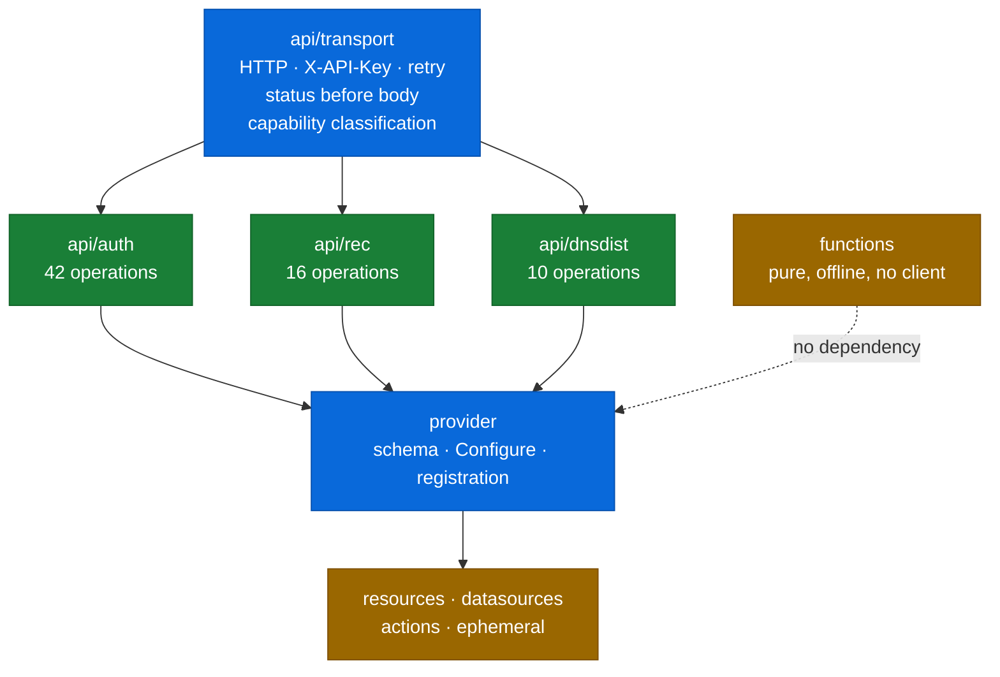

<!-- markdownlint-disable MD013 -->
<p align="center">
  <picture>
    <source media="(prefers-color-scheme: dark)" srcset="https://shieldcn.dev/header/graph.svg?title=AGENTS.md&subtitle=Read+this+before+touching+code&logo=github&mode=dark&align=left&font=geist-mono&border=false" />
    
  </picture>
</p>
<!-- markdownlint-enable MD013 -->

<div align="center">

[](#golden-rules)

[](docs/README.md)
[](#quality-gates)

</div>

# Agent & contributor guide — terraform-provider-powerdns

Canonical guide for anyone working in this repository, human or automated.
[`CODEX.md`](CODEX.md) and [`CLAUDE.md`](CLAUDE.md) are symlinks to this file.
Read it before touching code.

## What this is

A Terraform provider for the **PowerDNS family**, written from scratch on
`terraform-plugin-framework` (protocol 6):

| Product | Version targeted | API operations | Provider surface |
| --- | --- | ---: | --- |
| Authoritative Server | 5.1.3 | 42 | 9 resources, 9 data sources, 4 actions |
| Recursor | 5.4.4 | 16 | 2 resources, 3 data sources, 1 action |
| dnsdist | 2.1.0 | 10 | 1 resource, 4 data sources, 1 action |

The three share one credential model — `X-API-Key` on separate web servers —
which is why they are one provider and not three.

**dnsdist is thin on purpose.** Its API writes exactly two things:
`PUT /config/allow-from` and `DELETE /api/v1/cache`. Rules, pools, downstream
servers and dynamic blocks are Lua or YAML and are not reachable over HTTP. The
provider does not pretend otherwise; see
[`docs/adr/0006-dnsdist-scope.md`](docs/adr/0006-dnsdist-scope.md).

Registry address `ioplane/powerdns`. Module
`github.com/ioplane/terraform-provider-powerdns`. Licence Apache-2.0.

This is not a fork. Prior analysis of the ecosystem lives in the sibling
`powerdns-capability-map` repository and is cited, never copied.

## Golden rules

1. **Use the dev container.** No host toolchain. `task up && task shell`.
   Everything is baked into `golang:1.26-trixie`, pinned by digest. See
   [`docs/development.md`](docs/development.md).
2. **Latest, pinned by hash.** Newest releases, then pinned exactly: Go modules
   by version and `go.sum`, container images by `sha256:` digest, CI actions by
   commit SHA. A floating tag is a mutable reference and is rejected by
   `scripts/check-pins.sh`.
3. **Evidence before facts.** No claim about PowerDNS behaviour goes in without
   the **sources** (`PowerDNS/pdns` at the pinned tag) and a **live round-trip**
   against the lab. The published OpenAPI is not sufficient — it diverges from
   the implementation in both directions, which is our own finding
   ([PowerDNS/pdns#17807](https://github.com/PowerDNS/pdns/issues/17807)).
4. **Never write an exact identifier from memory.** SHAs, digests, versions,
   `file:line` citations — look them up and paste the result. See
   [`docs/standards/verified-identifiers.md`](docs/standards/verified-identifiers.md).
5. **Verify before "done".** Run the gate and quote its output. Update the
   task's status in [`docs/plan.md`](docs/plan.md) in the same commit as the
   work — a plan updated afterwards is a report, not a control.
6. **No secrets in state.** Terraform state is not encrypted. A DNSSEC private
   key or a TSIG secret is a write-only attribute or an ephemeral resource, never
   a `Sensitive` attribute. `Sensitive` redacts console output and nothing else.
7. **No secrets in the repository.** The lab key `labapikey` is a deliberately
   public test value bound to loopback; it is never reused.
8. **No AI attribution** in code, comments, documentation, commit messages, PR
   or MR bodies, or metadata. This overrides any tooling default that would add
   such a trailer. The exception is a third party whose own published policy
   requires disclosure — ask before filing there.

## Standards

Normative. Read the standard before changing the thing it governs.

| Area | Document |
| --- | --- |
| Naming — files, branches, resources, attributes | [`docs/standards/naming-conventions.md`](docs/standards/naming-conventions.md) |
| Versioning — SemVer 2.0.0 | [`docs/standards/versioning.md`](docs/standards/versioning.md) |
| Commits — Conventional Commits 1.0.0 | [`docs/standards/commits.md`](docs/standards/commits.md) |
| Changelog — Keep a Changelog 1.1.0 | [`docs/standards/changelog.md`](docs/standards/changelog.md) |
| Go 1.26 style | [`docs/standards/go-1.26-style.md`](docs/standards/go-1.26-style.md) |
| Provider design + Definition of Done | [`docs/standards/terraform-provider-best-practices.md`](docs/standards/terraform-provider-best-practices.md) |
| Terragrunt integration | [`docs/standards/terragrunt-integration.md`](docs/standards/terragrunt-integration.md) |
| PowerDNS API discipline | [`docs/standards/powerdns-api-discipline.md`](docs/standards/powerdns-api-discipline.md) |
| Python tooling — uv, ruff, ty | [`docs/standards/python-tooling.md`](docs/standards/python-tooling.md) |
| Verified identifiers | [`docs/standards/verified-identifiers.md`](docs/standards/verified-identifiers.md) |
| Markdown — structure, badges, diagrams | [`docs/standards/markdown-conventions.md`](docs/standards/markdown-conventions.md) |
| Methodology — roles, gates, sprints | [`docs/methodology.md`](docs/methodology.md) |
| **Delivery plan — live task status** | [`docs/plan.md`](docs/plan.md) |

Architectural decisions are immutable numbered records under
[`docs/adr/`](docs/adr/).

## Architecture in one page



Four rules, each earned from a defect observed in an existing provider:

1. **Nothing outside `internal/api/*` builds an HTTP request.** Leaked request
   construction is what produces inconsistent status handling.
2. **The client classifies capability, not just status.** A `422` from `/views`
   means "this backend has no views". One classifier in
   `api/transport/errors.go`; every resource gets the same diagnostic. Doing it
   per resource guarantees drift.
3. **Create, Read and Update share one mapper.** Letting Create write the plan
   while only Read consults the server hides normalisation drift.
4. **Server-side normalisation is compared semantically.** PowerDNS rewrites
   what it stores — `native` becomes `Native`, `:0000:` becomes `:0:`,
   `soa_edit_api` is assigned. String comparison makes every such configuration
   permanently dirty.

## Naming across three products

Unprefixed means **Authoritative**. This is a rule, not an accident:

| Product | Prefix | Example |
| --- | --- | --- |
| Authoritative | none | `powerdns_zone`, `powerdns_tsigkey` |
| Recursor | `recursor_` | `powerdns_recursor_zone` |
| dnsdist | `dnsdist_` | `powerdns_dnsdist_acl` |

Each product also gets its own endpoint and its own API key in the provider
block. They are separate web servers; sharing one key is a limitation, not a
convenience.

## Tooling you must use

| Tool | Why |
| --- | --- |
| **`gopls` LSP** | Navigate, rename, find references, read diagnostics — instead of grepping. |
| **`uv` / `ruff` / `ty`** | The Python gate for everything under `scripts/`. `task py`. |
| **`context7` MCP** | Current library documentation before writing code against it. Never training-data recall for a signature. |
| **`PowerDNS/pdns` sources** | The authority on API behaviour, at the pinned tags. |
| **The lab** | `task lab:up` — five services, three products, two authoritative backends. |

## The lab

Five services. The count is the design, not thoroughness:

| Endpoint | What | Why it exists |
| --- | --- | --- |
| `:18081` | Authoritative on PostgreSQL 17 | the common deployment |
| `:18091` | Authoritative on LMDB | **views and networks are unimplemented by gpgsql** — without this they are untestable |
| `:18082` | Recursor with `api_dir` set | without it every recursor write returns 422 |
| `:18083` | dnsdist | the only place its two write operations can be exercised |
| `:15432` | PostgreSQL | backend for the first |

```bash
task lab:up
task lab:verify     # asserts the fixture matches the pinned versions
task testacc
```

Namespace test objects `tf-acc-<RUN_ID>`; leave zero residue in `CheckDestroy`.
Never point acceptance tests at a production PowerDNS.

## Workflow

`main` is never committed to directly. Work happens on a branch in an isolated
worktree and merges by pull request.

**One worktree per sprint.** A sprint is the unit of review: it opens with a
worktree cut from `origin/main`, and closes with a pull request that is
squash-merged. Phases 0 to 4 were committed straight to `main`, which is the
rule being broken rather than an exception to it — the history is what it is,
and the rule applies from phase 5 onward.

1. `scripts/worktree.sh new sprint/<phase>-<name>`
2. Develop in the container: `task up && task shell`
3. Before pushing: `task all`. Resource changes also need `task verify`; quote
   the acceptance result in the commit body.
4. Update `CHANGELOG.md` under `[Unreleased]` and the task in `docs/plan.md`
5. Regenerate registry docs with `task docs` if the schema changed
6. Open a pull request titled as a Conventional Commit subject; squash-merge
7. `scripts/worktree.sh rm <branch>` once it is merged

Reviews happen on GitHub — see [ADR 0008](docs/adr/0008-github-only-review.md).

## Pipelines

Everything runs in GitHub Actions ([ADR 0009](docs/adr/0009-github-actions-is-the-gate.md)).

| Workflow | Owns | Runs on |
| --- | --- | --- |
| `ci.yml` | The gate — build, test, lint, docs, commits. Job for job, this is `task all` | every push and pull request |
| `acceptance.yml` | `task testacc` against the five-container lab | main, nightly, on demand |
| `security.yml` | CodeQL, Semgrep, osv-scanner, Trivy — findings become code-scanning alerts | push, pull request, weekly |
| `scorecard.yml` | OpenSSF Scorecard | main, weekly |
| `dependency-review.yml` | New dependencies: severity and licence | pull request |
| `release.yml` | GoReleaser, SBOMs, GPG signing, Registry publication | `v*.*.*` tags |

The toolchain is pinned in one place. `deployments/containers/Containerfile.dev`
holds every version; a workflow line naming one carries `# pin: <ARG>`; and
`task lint:tools` fails if the two disagree or if a marker is deleted. Without
that, CI and a developer's machine run different linters and argue about which
is right.

`.gitlab-ci.yml` is gone. It was never executed, and by the time it was removed
it referred to two scripts that do not exist and ran the contract tests with a
build tag they do not carry — which is what an unexecuted pipeline becomes.

## Quality gates

| Gate | Command |
| --- | --- |
| Build | `task build` |
| Unit + race | `task test` |
| Contract (recorded fixtures) | `task test:contract` |
| Acceptance, both backends | `task testacc` |
| golangci-lint v2 | `task lint` |
| Python — ruff + ty | `task py` |
| Pins resolve, none float | `task lint:pins` |
| CI and the dev image agree on tool versions | `task lint:tools` |
| Workflows parse and their expressions resolve | `task lint:actions` |
| Semantic security scan | `task semgrep` |
| Vulnerabilities | `task vulncheck` · `task osv-scan` |
| Registry docs | `task docs:check` |
| Pre-PR aggregate | `task all` |
| Full, including the lab | `task verify` |
