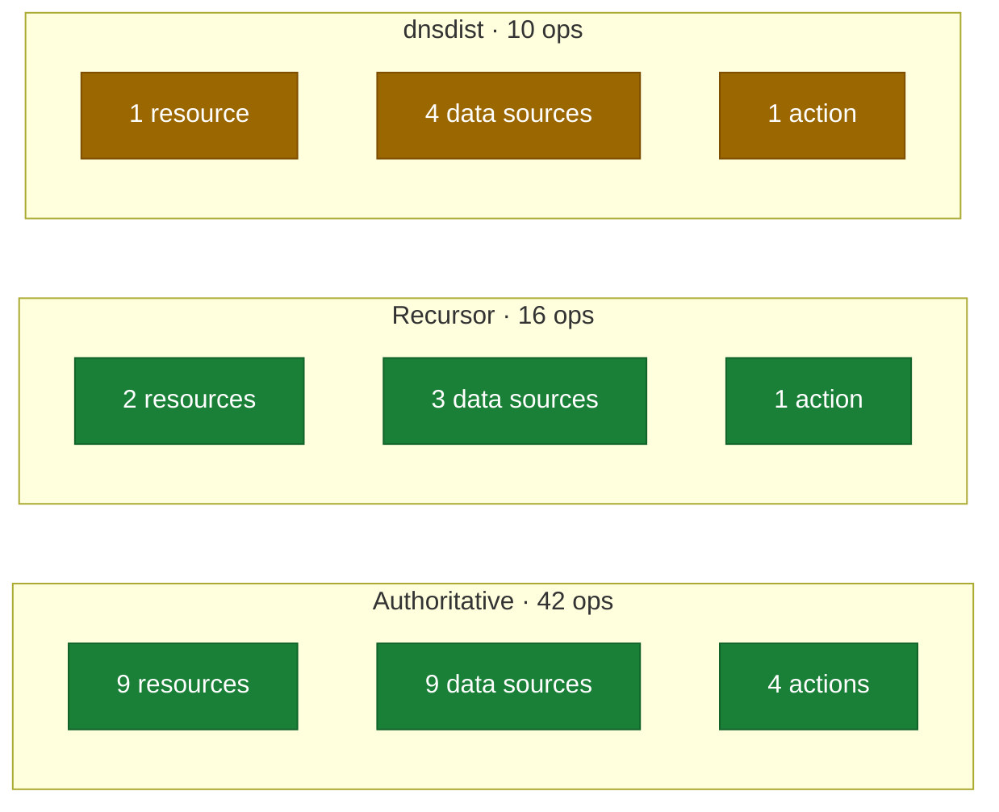

<!-- markdownlint-disable MD033 MD041 -->
<p align="center">
  <picture>
    <source media="(prefers-color-scheme: dark)" srcset="https://shieldcn.dev/header/graph.svg?title=terraform-provider-powerdns&subtitle=Authoritative+%2B+Recursor+%2B+dnsdist&logo=terraform&mode=dark&align=left&font=geist-mono&border=false" />
    
  </picture>
</p>

<div align="center">

[](LICENSE)
[](https://github.com/ioplane/terraform-provider-powerdns/commits/main)
[](https://github.com/ioplane/terraform-provider-powerdns/graphs/contributors)
[](https://github.com/ioplane/terraform-provider-powerdns/issues)
<br>
[](https://go.dev/doc/go1.26)
[](https://developer.hashicorp.com/terraform/plugin/framework)
[](https://developer.hashicorp.com/terraform)
[](docs/adr/0003-framework-protocol-6.md)
<br>
[](https://www.conventionalcommits.org/en/v1.0.0/)
[](https://semver.org/spec/v2.0.0.html)
[](https://keepachangelog.com/en/1.1.0/)
[](CONTRIBUTING.md)

</div>

# terraform-provider-powerdns

A Terraform provider for the **PowerDNS family** — Authoritative Server,
Recursor and dnsdist — on `terraform-plugin-framework`, protocol 6.

> **Status: in development.** The foundation is in place; the client and
> resources are being built. See [`docs/plan.md`](docs/plan.md) for exactly
> where it is. Not yet published to the Terraform Registry.

## Why one provider for three products

They share one credential model — `X-API-Key` on separate web servers — and are
deployed together. Each gets its own endpoint and its own key, and each product
prefixes its resources except Authoritative, which is unprefixed:

```hcl
provider "powerdns" {
  server_url          = "https://auth.example.com:8081"
  api_key             = var.auth_key
  recursor_server_url = "https://rec.example.com:8082"
  recursor_api_key    = var.rec_key
  dnsdist_server_url  = "https://ddist.example.com:8083"
  dnsdist_api_key     = var.ddist_key
}

resource "powerdns_zone" "example" { ... }
resource "powerdns_recursor_zone" "forward" { ... }
resource "powerdns_dnsdist_acl" "clients" { ... }
```

Configure only the products you use.

## Planned surface

| Product | API operations | Resources | Data sources | Actions |
|---|---:|---:|---:|---:|
| Authoritative 5.1.3 | 42 | 9 | 9 | 4 |
| Recursor 5.4.4 | 16 | 2 | 3 | 1 |
| dnsdist 2.1.0 | 10 | 1 | 4 | 1 |

Plus five provider functions and two ephemeral resources.

**dnsdist is thin because its API is.** Two of its ten operations write:
`PUT /config/allow-from` and `DELETE /api/v1/cache`. Rules, pools and
downstream servers are Lua or YAML and are not reachable over HTTP. See
[ADR 0006](docs/adr/0006-dnsdist-scope.md).

## Surface



Plus five provider functions and two ephemeral resources. dnsdist is amber
because its API is: two of its ten operations write.

## What this provider does differently

**It refuses at plan what the server would refuse at apply.** PowerDNS has
several conditions where an operation is impossible on a given installation —
views need the LMDB backend, recursor writes need `api_dir`, dnsdist writes
need `setAPIWritable` — and each surfaces as a bare `4xx`. The client
classifies them once and every resource reports the same actionable diagnostic.

**Secrets do not reach state.** DNSSEC private keys and TSIG secrets are
ephemeral resources or write-only attributes. Terraform state is not encrypted,
and `Sensitive` only redacts console output.

**Server-side normalisation is compared semantically.** PowerDNS rewrites what
it stores — `native` becomes `Native`, `:0000:` becomes `:0:` — and string
comparison makes such configurations permanently dirty.

## Development

```sh
task up        # dev container — no host toolchain needed
task lab:up    # five-service lab
task all       # the pre-merge gate
```

Start at [`AGENTS.md`](AGENTS.md); the documentation index is
[`docs/README.md`](docs/README.md).

## Licence

Apache-2.0.
