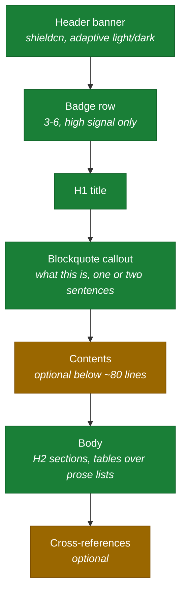
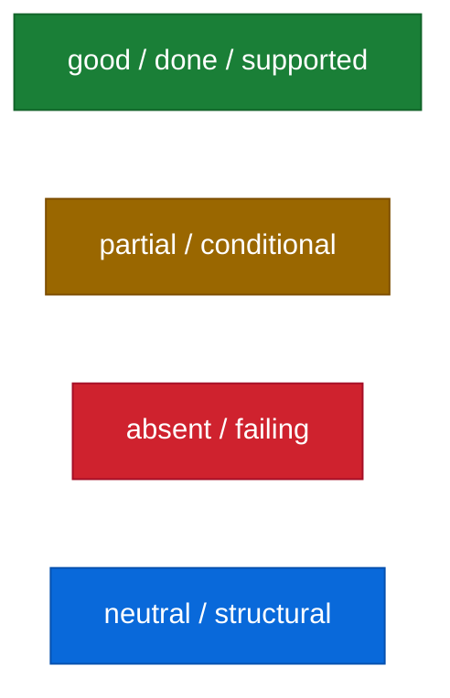

<!-- markdownlint-disable MD013 -->
<p align="center">
  <picture>
    <source media="(prefers-color-scheme: dark)" srcset="https://shieldcn.dev/header/graph.svg?title=Markdown+conventions&subtitle=Structure%2C+badges%2C+diagrams&logo=markdown&mode=dark&align=left&font=geist-mono&border=false" />
    
  </picture>
</p>
<!-- markdownlint-enable MD013 -->

<div align="center">

[](#per-document-type-requirements)
[](https://shieldcn.dev)
[](#diagrams)
[](#what-is-enforced)

</div>

# Markdown conventions

> **Every `.md` in this repository follows one structure.** A reader should be
> able to tell what a document is, who it binds and whether it is current
> without reading past the first screen.

---

## Contents

- [Why a template at all](#why-a-template-at-all)
- [The template](#the-template)
- [Badges](#badges)
- [Diagrams](#diagrams)
- [Extended markup](#extended-markup)
- [Per-document-type requirements](#per-document-type-requirements)
- [What is enforced](#what-is-enforced)

---

## Why a template at all

Documentation in a standards-heavy repository fails in a specific way: every
document is individually reasonable and collectively unnavigable. A reader
cannot tell a normative standard from a design note from a status record, so
they read everything or nothing.

The template fixes the **classification problem**, not the prose. It answers
four questions above the fold:

| Question | Answered by |
| --- | --- |
| What kind of document is this? | the header banner and the status badge row |
| Is it binding? | the callout under the title |
| Is it current? | the status badge, and `last-commit` where relevant |
| Where do I go next? | the contents block |

---

## The template

Every document has these parts, in this order. Parts marked optional are
omitted when they would be noise, never left empty.



### Skeleton

````markdown
<!-- markdownlint-disable MD033 MD041 -->
<p align="center">
  <picture>
    <source media="(prefers-color-scheme: dark)" srcset="https://shieldcn.dev/header/graph.svg?title=TITLE&subtitle=SUBTITLE&logo=LOGO&mode=dark&align=left&font=geist-mono&border=false" />
    
  </picture>
</p>

<div align="center">

[](LICENSE)
[](TARGET)

</div>

# Title

> **One-line classification.** What this document is and whether it binds.

---

## Contents
…
````

`MD033` and `MD041` are off repo-wide in `.markdownlint-cli2.yaml`, because
every document opens with an inline-HTML header that precedes the H1.

`MD013` is the one per-file disable, and it is **scoped to the header block**
rather than to the file:

````markdown
<!-- markdownlint-disable MD013 -->
<p align="center">
  …
</p>
<!-- markdownlint-enable MD013 -->
````

The two `<source>` and `` lines carry long URLs that cannot be wrapped.
Disabling the rule for the whole file would silently exempt the prose, which is
the part the 100-column limit exists for.

### Tables

Delimiter rows are spaced — `| --- | --- |`, not `|---|---|` — because `MD060`
infers the table's style from its content rows and a compact delimiter row
against spaced content is an inconsistency it reports on every cell.

---

## Badges

Badges come from [shieldcn](https://shieldcn.dev). They are
`shields.io`-compatible in spirit but render as shadcn/ui components, which
keeps a documentation set visually coherent.

### Rules

1. **Prefer a dynamic endpoint to a static label.** `github/license` reads the
   real licence; `badge/license-Apache--2.0` is a claim that rots. A static
   badge is for a fact with no endpoint behind it — a language version, a
   convention adopted.
2. **Never ship a badge whose endpoint errors.** GitHub Actions owns the
   quality gate, and the CI badge names `workflow=ci.yml` so it cannot drift to
   another workflow. A broken image on the front page is worse than an absent
   one. Check the endpoint's `.json` response before adding.
3. **Three to six per row, at most three rows.** Group them by meaning —
   repository state, stack, conventions — and separate rows with `<br>`.
4. **Do not set `size`.** The shieldcn default is `sm` (184×32), which is what
   the sibling `terraform-provider-cvp` renders and what sits correctly beside
   body text. `xs` is unreadable; `lg` is oversized and dominates the heading it
   follows. Both were tried here before landing on the default.
5. **`variant=secondary` by default**, `branded` for at most one accent badge.
   Single-surface — do not use `split=true`, which produces the two-tone
   shields.io look this project does not use.
6. **A badge with a destination is a link; a badge without one is an image.**
   Use `[](target)` where a target exists — a licence badge to
   `LICENSE`, a version badge to that version's release notes, a convention
   badge to the specification. Where none does, write `` and stop.
   **Never `](#)`**: it renders as clickable, leads nowhere, and jumps the
   reader to the top of the page. `MD042` rejects it.
7. **Colour carries meaning**: `00ADD8` Go, `7B42BC` Terraform, `FE5196`
   Conventional Commits, `3fb950` a satisfied convention, `cf222e` binding,
   `0969da` structural.
8. **SVG, not PNG.** PNG only where the host blocks SVG.

Wrap the rows in `<div align="center">` with blank lines around the markdown,
so GitHub renders the links rather than the raw HTML.

### The rows this repository uses

| Document type | Rows |
| --- | --- |
| `README.md` | state (dynamic) · stack · conventions |
| `AGENTS.md` | binding · audience · standards · gates |
| Standards | scope · what it governs · how it is enforced |
| ADRs | status · date · deciders |
| `plan.md` | current phase · phase 0 state · tasks done · last commit |

### Endpoints in use

```text
https://shieldcn.dev/github/{topic}/{owner}/{repo}.svg?variant=secondary
https://shieldcn.dev/badge/{label}-{value}-{hex}.svg?variant=secondary&logo=…
https://shieldcn.dev/header/graph.svg?title=…&subtitle=…&mode=…
```

Verified dynamic topics for this repository: `license`, `last-commit`,
`contributors`, `issues`, `open-prs`, `stars`, `release`. `ci` is **not**
available here — see rule 2.

Append `.json` to any badge URL to see the value it will render. That is how
rule 2 is checked, and `scripts/checks/badges.py` does it for every badge in the
tree.

---

## Diagrams

**Mermaid, always.** No ASCII art, no committed images for anything a diagram
can express. GitHub renders mermaid natively, so the diagram stays diffable and
searchable.

### When to draw one

A diagram earns its place when the relationship is **not linear**. A sequence of
steps is a numbered list. A dependency graph, a state machine or a decision with
branches is a diagram.

### Palette

One palette across the repository, so colour carries meaning rather than
decoration:



### Rules

- Node labels quoted: `A["text"]`. Unquoted labels break on punctuation.
- `<br/>` for line breaks inside a node; keep nodes under about four lines.
- No colons in an unquoted string — YAML-adjacent parsers treat them as
  mappings.
- A `gantt` task id must not collide with a status keyword (`done`, `crit`,
  `active`).

---

## Extended markup

| Device | Use |
| --- | --- |
| **Tables** | Any comparison of three or more things. Prefer a table to a prose list. |
| **Blockquote callouts** | The classification line under the title, and warnings that change what a reader should do. |
| **Collapsible `<details>`** | Long output, full command transcripts, superseded text kept for the record. |
| **Task lists** | Status in `plan.md` only. Elsewhere they imply a mutable checklist that nobody updates. |
| **Footnotes** | Provenance that would interrupt a sentence. |
| **Fenced blocks with a language** | Always. `console` for transcripts, `text` for output with no syntax. |
| **Horizontal rules** | Between top-level sections in documents over about 150 lines. |

Anchors are the GitHub-generated slug of the heading; a table of contents links
to those and nothing else.

---

## Per-document-type requirements

| Type | Header | Badges | Mermaid | Contents |
| --- | --- | --- | --- | --- |
| `README.md` | required | required | required — the surface or architecture | required |
| `AGENTS.md` | required | required | required — the architecture | required |
| Standards | required | required | where a relationship is non-linear | over 80 lines |
| ADRs | required | status, date, deciders | where the decision has branches | no |
| `plan.md` | required | phase and progress | the phase graph | required |
| `methodology.md` | required | required | the phase gates | required |

An ADR is the one type where a diagram is usually unnecessary: a decision record
is prose plus a table of alternatives, and forcing a diagram onto it produces
decoration.

---

## What is enforced

| Rule | Enforced by |
| --- | --- |
| Heading structure, list style, line length | `markdownlint-cli2` against `.markdownlint-cli2.yaml` |
| Spelling and accepted abbreviations | `cspell` against `.cspell.json` |
| Front-matter and code-fence languages | `markdownlint-cli2` |
| Badge URLs resolve | `scripts/checks/badges.py` |
| Mermaid blocks parse | `scripts/checks/badges.py` |

`scripts/checks/badges.py` runs in `task docs:lint`. A badge pointing at a
non-existent endpoint renders as a broken image on the front page of the
project, which is the kind of defect nobody notices in review and everybody
notices afterwards.
