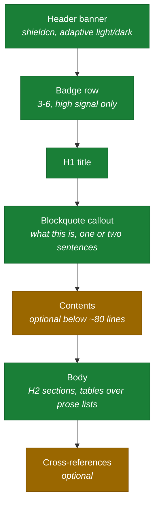
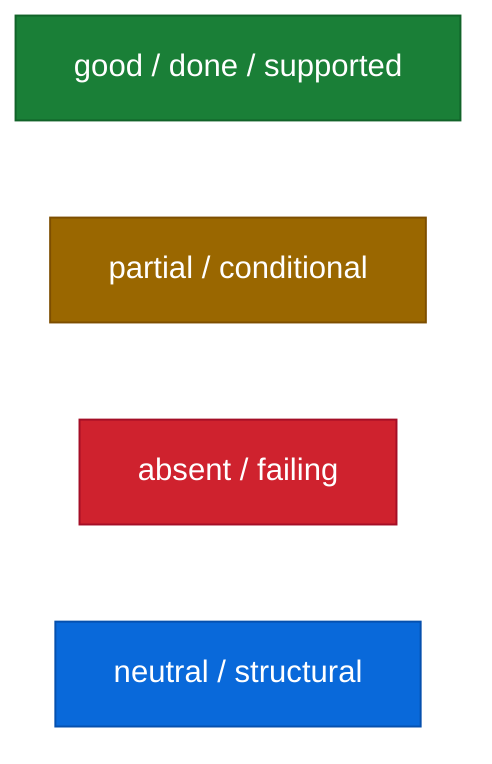

<!-- markdownlint-disable MD033 MD041 -->
<p align="center">
  <picture>
    <source media="(prefers-color-scheme: dark)" srcset="https://shieldcn.dev/header/graph.svg?title=Markdown+conventions&subtitle=Structure%2C+badges%2C+diagrams&logo=markdown&mode=dark&align=left&font=geist-mono&border=false" />
    
  </picture>
</p>

<p align="center">
  
  
  
  
</p>

# Markdown conventions

> **Every `.md` in this repository follows one structure.** A reader should be
> able to tell what a document is, who it binds and whether it is current
> without reading past the first screen.

---

## Contents

- [Why a template at all](#why-a-template-at-all)
- [The template](#the-template)
- [Badges](#badges)
- [Diagrams](#diagrams)
- [Extended markup](#extended-markup)
- [Per-document-type requirements](#per-document-type-requirements)
- [What is enforced](#what-is-enforced)

---

## Why a template at all

Documentation in a standards-heavy repository fails in a specific way: every
document is individually reasonable and collectively unnavigable. A reader
cannot tell a normative standard from a design note from a status record, so
they read everything or nothing.

The template fixes the **classification problem**, not the prose. It answers
four questions above the fold:

| Question | Answered by |
|---|---|
| What kind of document is this? | the header banner and the status badge row |
| Is it binding? | the callout under the title |
| Is it current? | the status badge, and `last-commit` where relevant |
| Where do I go next? | the contents block |

---

## The template

Every document has these parts, in this order. Parts marked optional are
omitted when they would be noise, never left empty.



### Skeleton

````markdown
<!-- markdownlint-disable MD033 MD041 -->
<p align="center">
  <picture>
    <source media="(prefers-color-scheme: dark)" srcset="https://shieldcn.dev/header/graph.svg?title=TITLE&subtitle=SUBTITLE&logo=LOGO&mode=dark&align=left&font=geist-mono&border=false" />
    
  </picture>
</p>

<p align="center">
  
</p>

# Title

> **One-line classification.** What this document is and whether it binds.

---

## Contents
…
````

`MD033` and `MD041` are disabled per file because the header is inline HTML and
precedes the H1. That is the only permitted disable, and it goes at the top of
the file rather than scattered through it.

---

## Badges

Badges come from [shieldcn](https://shieldcn.dev). They are
`shields.io`-compatible in spirit but render as shadcn/ui components, which
keeps a documentation set visually coherent.

### Rules

1. **Three to six.** More is decoration and stops being read.
2. **High signal only.** A badge earns its place by answering a question a
   reader actually has.
3. **Adaptive.** Use `<picture>` with `mode=dark` and `mode=light` sources
   wherever the badge is not already neutral.
4. **Clickable when it represents a page.** Wrap in `<a>`; a licence badge
   links to `LICENSE`, a CI badge to the pipeline.
5. **No placeholders.** A badge pointing at a repository that does not exist is
   worse than no badge.
6. **SVG, not PNG.** PNG only where the host blocks SVG.

### The rows this repository uses

| Document type | Row |
|---|---|
| `README.md` | status · licence · Terraform version · Go version · last commit |
| Standards | scope · what it governs · enforcement |
| ADRs | status (`accepted`/`superseded`) · date · deciders |
| `plan.md` | current phase · tasks done · gate state |

### Endpoints in use

```text
https://shieldcn.dev/github/license/{owner}/{repo}.svg
https://shieldcn.dev/github/last-commit/{owner}/{repo}.svg
https://shieldcn.dev/github/ci/{owner}/{repo}.svg?workflow=…&branch=main
https://shieldcn.dev/badge/{label}-{message}.svg?variant=branded&size=xs&logo=…
https://shieldcn.dev/header/graph.svg?title=…&subtitle=…&mode=…
```

Underscores become spaces in a static badge; a literal hyphen is `--`.

---

## Diagrams

**Mermaid, always.** No ASCII art, no committed images for anything a diagram
can express. GitHub renders mermaid natively, so the diagram stays diffable and
searchable.

### When to draw one

A diagram earns its place when the relationship is **not linear**. A sequence of
steps is a numbered list. A dependency graph, a state machine or a decision with
branches is a diagram.

### Palette

One palette across the repository, so colour carries meaning rather than
decoration:



### Rules

- Node labels quoted: `A["text"]`. Unquoted labels break on punctuation.
- `<br/>` for line breaks inside a node; keep nodes under about four lines.
- No colons in an unquoted string — YAML-adjacent parsers treat them as
  mappings.
- A `gantt` task id must not collide with a status keyword (`done`, `crit`,
  `active`).

---

## Extended markup

| Device | Use |
|---|---|
| **Tables** | Any comparison of three or more things. Prefer a table to a prose list. |
| **Blockquote callouts** | The classification line under the title, and warnings that change what a reader should do. |
| **Collapsible `<details>`** | Long output, full command transcripts, superseded text kept for the record. |
| **Task lists** | Status in `plan.md` only. Elsewhere they imply a mutable checklist that nobody updates. |
| **Footnotes** | Provenance that would interrupt a sentence. |
| **Fenced blocks with a language** | Always. `console` for transcripts, `text` for output with no syntax. |
| **Horizontal rules** | Between top-level sections in documents over about 150 lines. |

Anchors are the GitHub-generated slug of the heading; a table of contents links
to those and nothing else.

---

## Per-document-type requirements

| Type | Header | Badges | Mermaid | Contents |
|---|---|---|---|---|
| `README.md` | required | required | required — the surface or architecture | required |
| `AGENTS.md` | required | required | required — the architecture | required |
| Standards | required | required | where a relationship is non-linear | over 80 lines |
| ADRs | required | status, date, deciders | where the decision has branches | no |
| `plan.md` | required | phase and progress | the phase graph | required |
| `methodology.md` | required | required | the phase gates | required |

An ADR is the one type where a diagram is usually unnecessary: a decision record
is prose plus a table of alternatives, and forcing a diagram onto it produces
decoration.

---

## What is enforced

| Rule | Enforced by |
|---|---|
| Heading structure, list style, line length | `markdownlint-cli2` against `.markdownlint-cli2.yaml` |
| Spelling and accepted abbreviations | `cspell` against `.cspell.json` |
| Front-matter and code-fence languages | `markdownlint-cli2` |
| Badge URLs resolve | `scripts/check-badges.sh` |
| Mermaid blocks parse | `scripts/check-badges.sh` |

`scripts/check-badges.sh` runs in `task docs:lint`. A badge pointing at a
non-existent endpoint renders as a broken image on the front page of the
project, which is the kind of defect nobody notices in review and everybody
notices afterwards.
